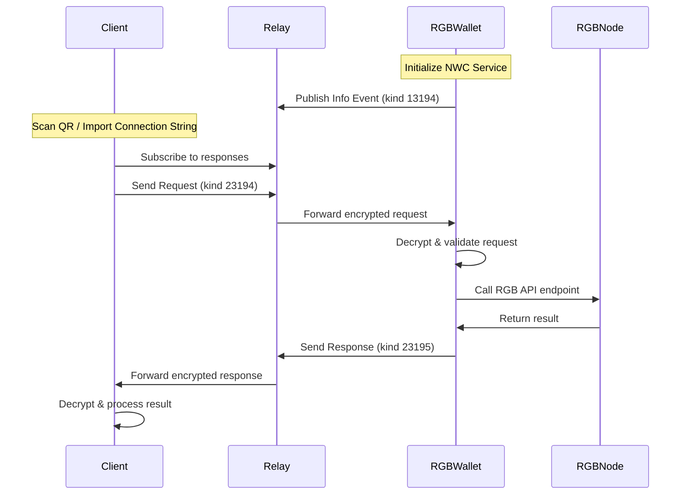

# Nostr Wallet Connect Implementation Summary

## Overview

This implementation provides a complete Nostr Wallet Connect (NWC) solution for the RGB Lightning Node, following the NIP-47 specification. The system allows external Nostr clients to securely control the RGB Lightning Node through encrypted messages over Nostr relays.

## Files Created/Modified

### Core Services

1. **`NWCService.ts`** - Main NWC implementation
   - NIP-47 protocol implementation
   - Request/response handling
   - Connection management
   - Error handling with standardized codes
   - Integration with RGB API endpoints

2. **`NostrService.ts`** - Enhanced with NWC integration
   - Added NWC service initialization
   - Connection string generation
   - Service status monitoring
   - Cleanup integration

3. **`initializeServices.ts`** - Updated with NWC initialization
   - `initializeNostrWalletConnect()` function
   - `getNostrWalletConnectStatus()` function
   - Service configuration management

### UI Components

4. **`NWCWalletScreen.tsx`** - React Native UI component
   - Service status display
   - Connection string generation with QR codes
   - Permission management
   - Real-time status monitoring

### Documentation

5. **`README_NWC.md`** - Comprehensive documentation
   - Usage examples
   - Client implementation guide
   - Security considerations
   - Troubleshooting guide

## Key Features

### ✅ Standard NWC Methods Implemented

- `pay_invoice` - Pay Lightning invoices
- `make_invoice` - Create Lightning invoices  
- `get_balance` - Get Bitcoin balance
- `get_info` - Get node information
- `lookup_invoice` - Look up invoice status
- `list_transactions` - List payment history

### ✅ Security Features

- **Encrypted Communication**: All messages encrypted with NIP-04
- **Permission System**: Granular access control per connection
- **Unique Keys**: Each client connection uses unique secret keys
- **Connection Management**: Track and manage active connections
- **Error Handling**: Standardized NIP-47 error codes

### ✅ Integration Features

- **RGB API Integration**: Maps NWC methods to RGB Lightning Node endpoints
- **Service Initialization**: Seamless integration with existing service structure
- **Real-time Monitoring**: Live status updates and connection tracking
- **QR Code Support**: Easy connection sharing via QR codes

## NWC Protocol Flow



## RGB Lightning Node API Mapping

| NWC Method | RGB API Endpoint | Description |
|------------|------------------|-------------|
| `pay_invoice` | `/sendpayment` | Pay Lightning invoice |
| `make_invoice` | `/lninvoice` | Create Lightning invoice |
| `get_balance` | `/btcbalance` | Get Bitcoin balance |
| `get_info` | `/nodeinfo` | Get node information |
| `lookup_invoice` | Payment lookup | Look up payment status |
| `list_transactions` | `/listpayments` | List payment history |

## Connection String Format

```
nostr+walletconnect://<wallet_pubkey>?relay=<relay1>&relay=<relay2>&secret=<client_secret>&lud16=<lightning_address>
```

### Parameters:
- `wallet_pubkey`: Wallet's public key (32 bytes hex)
- `relay`: Nostr relay URLs (multiple allowed)
- `secret`: Client's secret key (32 bytes hex)
- `lud16`: Optional Lightning Address

## Usage Examples

### Initialize Service

```typescript
import { initializeNostrWalletConnect } from './services/initializeServices';

const success = await initializeNostrWalletConnect();
console.log('NWC initialized:', success);
```

### Generate Connection String

```typescript
import NostrService from './services/NostrService';

const nostrService = NostrService.getInstance();
const connectionString = await nostrService.getWalletConnectInfo([
  'pay_invoice',
  'make_invoice', 
  'get_balance'
]);
```

### Client Integration

```javascript
import { NWCClient } from './nwc-client';

const client = new NWCClient(connectionString);
await client.connect();

// Pay invoice
const result = await client.payInvoice('lnbc...');

// Get balance  
const balance = await client.getBalance();
```

## Security Considerations

### 🔒 Key Security Features

1. **Unique Connection Keys**: Each client gets a unique secret key
2. **Permission-Based Access**: Granular control over allowed operations
3. **Encrypted Messages**: All communication encrypted with NIP-04
4. **Connection Tracking**: Monitor and manage active connections
5. **Error Standardization**: Consistent error handling and codes

### 🛡️ Best Practices

- Only share connection strings with trusted devices
- Use restricted permissions for specific use cases
- Monitor active connections regularly
- Use trusted Nostr relays
- Consider implementing connection expiry

## Future Extensions

### RGB Asset Support (Planned)

```typescript
// Planned RGB-specific methods
interface RGBNWCExtensions {
  pay_rgb_invoice: (params: { invoice: string, asset_id?: string }) => Promise<any>;
  make_rgb_invoice: (params: { asset_id: string, amount: number }) => Promise<any>;
  get_rgb_balance: (params: { asset_id?: string }) => Promise<any>;
  list_rgb_assets: (params: {}) => Promise<any>;
  send_rgb_asset: (params: { asset_id: string, amount: number, address: string }) => Promise<any>;
}
```

### Multi-Asset Transactions

Support for complex transactions involving multiple RGB assets with cross-asset fee payments.

### Enhanced Permissions

More granular permission system with spending limits, time-based restrictions, and asset-specific permissions.

## Testing

### Manual Testing Steps

1. Initialize NWC service
2. Generate connection string
3. Import in compatible client
4. Test basic operations:
   - Get balance
   - Create invoice
   - Pay invoice
   - List transactions

### Integration Testing

- Test with multiple concurrent clients
- Verify permission enforcement
- Test error handling scenarios
- Validate encrypted communication

## Deployment

### Environment Configuration

```bash
# Nostr relays
NOSTR_RELAYS=wss://relay.damus.io,wss://relay.snort.social

# RGB Node endpoint  
RGB_NODE_URL=http://localhost:3001

# Optional Lightning Address
LUD16=wallet@domain.com
```

### Service Startup

```typescript
// Initialize all services
await initializeRGBApiService();
await initializeNostrWalletConnect();

// Check status
const status = await getNostrWalletConnectStatus();
console.log('NWC Status:', status);
```

## Monitoring & Debugging

### Status Monitoring

```typescript
const status = await getNostrWalletConnectStatus();
// Returns: { isRunning: boolean, connections: number, supportedMethods: string[] }
```

### Debug Logging

- NWC service logs connection events
- Request/response processing logs
- Error condition logging
- RGB API interaction logs

## Compliance

### NIP-47 Compliance

✅ **Event Types**: Implements all required event kinds (13194, 23194, 23195, 23196)  
✅ **Error Codes**: Uses standardized error codes  
✅ **Encryption**: NIP-04 encryption for all messages  
✅ **Methods**: Implements core payment methods  
✅ **Notifications**: Support for payment notifications  

### Standards Compatibility

- Compatible with existing NWC clients
- Follows Nostr event standards
- Uses standard Lightning invoice formats
- Implements proper error handling

This implementation provides a solid foundation for Nostr Wallet Connect integration with the RGB Lightning Node, enabling secure remote wallet control while maintaining compatibility with the broader Nostr ecosystem. 